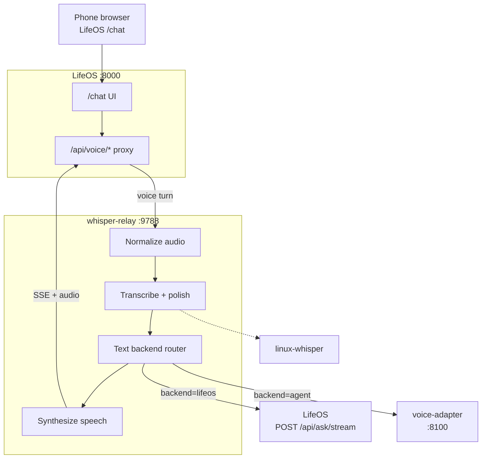

# whisper-relay

whisper-relay is a **voice transport API** for **LifeOS** and optional **OpenClaw Agent** mode. The **client UI** is LifeOS responsive `/chat` ([ADR-005](docs/adr/005-lifeos-owned-chat-client.md)); this service handles STT, text-backend routing, and TTS only.

whisper-relay turns speech into text, submits that text to a **text backend** (LifeOS or the OpenClaw voice-adapter in [agents](https://github.com/nbramia/agents)), then speaks the reply. It does not run an agent, duplicate orchestrator tools, or make routing decisions.

## How it fits together

whisper-relay sits between LifeOS `/chat` and local services on your Linux workstation:

| Component | Role |
|-----------|------|
| **LifeOS `/chat`** | Unified text + voice client (phone bookmark over Tailscale HTTPS) |
| **whisper-relay** (this repo) | Voice transport API — normalize audio, STT, text backend, TTS |
| **linux-whisper** | Local STT + polish (same pipeline as desktop dictation) |
| **LifeOS** (LifeOS mode) | Orchestrator — tools, memory, planning, engine handoffs |
| **voice-adapter** (Agent mode) | OpenClaw HTTP bridge in agents repo — session + escalation ([ADR-004](docs/adr/004-dual-text-backends.md)) |



**One turn:** record in LifeOS voice mode → LifeOS proxies to whisper-relay → STT/TTS + text backend → spoken reply in the same conversation thread.

## What it does

- Voice turn API for LifeOS `/chat` (proxied same-origin over Tailscale HTTPS)
- Multi-turn conversations — separate `conversation_id` threads per backend (LifeOS or Agent)
- **LifeOS | Agent** backend selection from the LifeOS client ([ADR-004](docs/adr/004-dual-text-backends.md))
- Per-turn `model_override` forwarded to LifeOS `/api/ask/stream` ([issue #24](https://github.com/nbramia/whisper-relay/issues/24))
- Spoken status updates during long tool rounds
- Engine handoffs in LifeOS mode (`claude_intent` → `/api/chat/handoff`)
- Headless autostart via systemd (API on `127.0.0.1:9788`)

## What it does not do

whisper-relay is transport only. It does not:

- Run an agent, define tools, or classify intent
- Listen continuously or stream STT in real time
- Replace LifeOS or linux-whisper — it calls them

Not supported today: native mobile app, WebRTC, third-party voice platforms (Vapi, Retell, Twilio, LiveKit, OpenAI Realtime, etc.).

## Quick start

```bash
git clone <repository-url> whisper-relay
cd whisper-relay
pip install -e ".[dev]"
pip install -e ../linux-whisper   # sibling checkout; GPU STT

# System deps (Ubuntu)
sudo apt install ffmpeg espeak-ng

# Kokoro TTS models (see ADR-003)
bash scripts/setup-kokoro.sh

# Copy env template only on a fresh clone (skip if .env already exists):
#   test -f .env || cp .env.example .env
# If .env is a symlink, cp overwrites the link target — edit the Sync copy directly.

# Run API on localhost (LifeOS reverse-proxies /api/voice/* here)
uvicorn voice_gateway.main:app --host 127.0.0.1 --port "${VOICE_GATEWAY_PORT:-9788}"
```

**Phone:** open LifeOS `/chat` over Tailscale HTTPS — see LifeOS `scripts/setup-tailscale.sh` and `TAILNET_HTTPS_URL` in LifeOS `.env`. Example: `https://<machine>.<tailnet>.ts.net/chat`

Legacy direct hits to whisper-relay `GET /` redirect (301) to `{LIFEOS_BASE_URL}/chat`.

For CI or local dev without Kokoro models, set `TTS_BACKEND=null` in `.env`.

### LifeOS integration

LifeOS `/chat` is the client ([ADR-005](docs/adr/005-lifeos-owned-chat-client.md)). LifeOS reverse-proxies `/api/voice/*` to whisper-relay so the browser stays same-origin. Set in **LifeOS** `.env`:

```bash
VOICE_GATEWAY_URL=http://127.0.0.1:9788
```

whisper-relay listens on `127.0.0.1:9788` by default (`VOICE_GATEWAY_PORT=9788`). Direct browser → whisper-relay calls with CORS are a documented fallback only, not the primary path.

### Agent mode smoke test

With [voice-adapter](https://github.com/nbramia/agents) running (`curl -s localhost:8100/healthz` → `{"ok":true,...}`):

1. Set `AGENT_BACKEND_URL=http://127.0.0.1:8100` in `.env`
2. Open LifeOS `/chat` over Tailscale HTTPS, select **Agent**, use voice mode
3. Optional: `curl -s localhost:9788/health/backends`

## Prerequisites

- Linux workstation on your tailnet (GPU recommended for linux-whisper)
- **linux-whisper** installed and configured (`~/.config/linux-whisper/config.yaml`)
- **LifeOS** running locally (default `http://127.0.0.1:8000`) for LifeOS mode
- **agents voice-adapter** (optional) for Agent mode — `docker compose --profile voice up` in [agents](https://github.com/nbramia/agents); set `AGENT_BACKEND_URL=http://127.0.0.1:8100` (see [ADR-004](docs/adr/004-dual-text-backends.md))
- `ffmpeg` for audio normalization
- Tailscale for phone → Linux access
- Kokoro TTS — see [ADR-003](docs/adr/003-kokoro-tts-bm-george.md)

### Autostart on boot (headless)

Set `DEPLOY_*` paths in `.env`, then install user systemd units and enable linger (starts at boot without a graphical login — same pattern as sibling services on a linger-enabled workstation):

```bash
bash scripts/install-autostart.sh
```

This enables `whisper-relay.service` (uvicorn on localhost). Tailscale HTTPS is configured in **LifeOS** (`lifeos-tailscale.service`), not whisper-relay.

```bash
systemctl --user status whisper-relay
journalctl --user -u whisper-relay -f
```

Manual install:

```bash
bash scripts/install-systemd-user.sh
sudo loginctl enable-linger "$USER"   # once per machine
systemctl --user enable --now whisper-relay
```

`scripts/setup-tailscale.sh` is **deprecated** — do not expose whisper-relay UI on the tailnet (ADR-005).

System-wide service alternative (set `DEPLOY_SYSTEMD_USER` in `.env`):

```bash
bash scripts/install-systemd.sh
sudo systemctl enable --now whisper-relay
```

## Documentation

**Contributing / AI agents:** start with [AGENTS.md](AGENTS.md) and [CLAUDE.md](CLAUDE.md).

| Document | Purpose |
|----------|---------|
| [docs/README.md](docs/README.md) | Documentation index |
| [docs/development-principles.md](docs/development-principles.md) | Engineering principles |
| [docs/specs/standards/code-conventions.md](docs/specs/standards/code-conventions.md) | Python and adapter conventions |
| [docs/specs/standards/testing-standards.md](docs/specs/standards/testing-standards.md) | Testing rules |
| [ADR-001](docs/adr/001-voice-transport-layer.md) | Voice transport layer — what whisper-relay is and is not |
| [ADR-002](docs/adr/002-upstream-integration-boundaries.md) | linux-whisper + LifeOS integration boundaries |
| [ADR-003](docs/adr/003-kokoro-tts-bm-george.md) | Kokoro TTS — `bm_george` voice |
| [ADR-004](docs/adr/004-dual-text-backends.md) | LifeOS vs Agent backend toggle |
| [ADR-005](docs/adr/005-lifeos-owned-chat-client.md) | LifeOS-owned `/chat` client; API-only gateway (Accepted) |

## License

MIT
