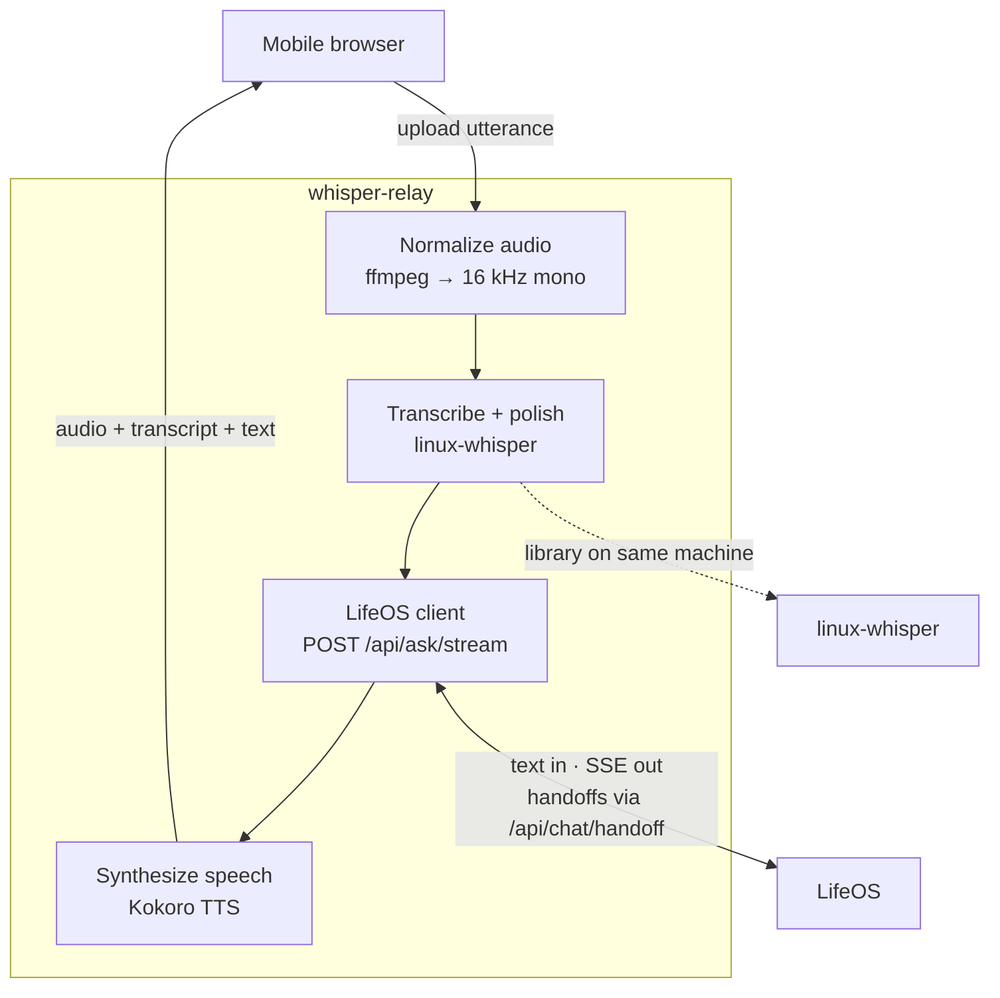

# whisper-relay

A voice transport layer for **LifeOS** — push-to-talk from your phone, spoken answers back.

whisper-relay turns speech into text, hands that text to LifeOS exactly as if you had typed it in the web chat or sent it via Telegram, then speaks LifeOS's reply. It does not run an agent, duplicate LifeOS tools, or make routing decisions. LifeOS behaves the same regardless of whether input came from a keyboard, Telegram, or your voice.

## How it fits together

whisper-relay sits between your phone and two services on your Linux workstation:

| Component | Role |
|-----------|------|
| **Mobile browser** | Tap-to-talk UI over Tailscale HTTPS |
| **whisper-relay** (this repo) | Normalize audio, transcribe, call LifeOS, synthesize speech, return audio |
| **linux-whisper** | Local STT + polish (same pipeline as desktop dictation) |
| **LifeOS** | Orchestrator — tools, memory, planning, engine handoffs |



**One turn:** record on the phone → whisper-relay runs the pipeline above → you hear the reply and can keep talking in the same LifeOS conversation thread.

## What it does

- Tap-to-talk from a phone browser (Chrome or Safari, iOS or Android) over Tailscale
- Multi-turn conversations — separate `conversation_id` threads per backend (LifeOS or Agent)
- **LifeOS | Agent** toggle — Agent mode routes to OpenClaw voice-adapter ([ADR-004](docs/adr/004-dual-text-backends.md))
- Spoken status updates while the text backend works through long turns
- Engine handoffs in LifeOS mode (`claude_intent` → `/api/chat/handoff`) — same behavior as web chat
- Headless autostart on your workstation via systemd

## What it does not do

whisper-relay is transport only. It does not:

- Run an agent, define tools, or classify intent
- Listen continuously or stream STT in real time
- Replace LifeOS or linux-whisper — it calls them

Not supported today: native mobile app, WebRTC, third-party voice platforms (Vapi, Retell, Twilio, LiveKit, OpenAI Realtime, etc.).

## Quick start

```bash
git clone <repository-url> whisper-relay
cd whisper-relay
pip install -e ".[dev]"
pip install -e ../linux-whisper   # sibling checkout; GPU STT

# System deps (Ubuntu)
sudo apt install ffmpeg espeak-ng

# Kokoro TTS models (see ADR-003)
bash scripts/setup-kokoro.sh

# Copy env template only on a fresh clone (skip if .env already exists):
#   test -f .env || cp .env.example .env
# If .env is a symlink, cp overwrites the link target — edit the Sync copy directly.

# Run (internal port — Tailscale Serve proxies this to the tailnet)
uvicorn voice_gateway.main:app --host 127.0.0.1 --port "${VOICE_GATEWAY_PORT:-8888}"

# Expose on tailnet (run scripts/setup-tailscale.sh once)
bash scripts/setup-tailscale.sh
```

Set `TAILNET_HTTPS_URL` in `.env` to your machine's Tailscale HTTPS URL (from `tailscale status` / MagicDNS).

| URL | Works? | Microphone? |
|-----|--------|-------------|
| `https://<machine>.<tailnet>.ts.net` | Yes | Yes — **use HTTPS on your phone** |
| `http://<machine>.<tailnet>.ts.net:<TAILNET_HTTP_PORT>` | Yes | No (browser blocks mic on HTTP) |
| `http://…:443` or `http://…` when that port is HTTPS | **No** — shows "Client sent an HTTP request to an HTTPS server" | — |

Open your **`TAILNET_HTTPS_URL`** on your phone (note `https`, no port). HTTP on port 443 is not valid — that port speaks TLS only.

For CI or local dev without Kokoro models, set `TTS_BACKEND=null` in `.env`.

### Agent mode smoke test

With [voice-adapter](https://github.com/nbramia/agents) running (`curl -s localhost:8100/healthz` → `{"ok":true,...}`):

1. Set `AGENT_BACKEND_URL=http://127.0.0.1:8100` in `.env`
2. Open the mobile UI over Tailscale HTTPS
3. Toggle **Agent** in the top bar and speak a turn
4. Optional: `curl -s localhost:8888/health/backends` — both backends should report reachability when services are up

## Prerequisites

- Linux workstation on your tailnet (GPU recommended for linux-whisper)
- **linux-whisper** installed and configured (`~/.config/linux-whisper/config.yaml`)
- **LifeOS** running locally (default `http://127.0.0.1:8000`) for LifeOS mode
- **agents voice-adapter** (optional) for Agent mode — `docker compose --profile voice up` in [agents](https://github.com/nbramia/agents); set `AGENT_BACKEND_URL=http://127.0.0.1:8100` (see [ADR-004](docs/adr/004-dual-text-backends.md))
- `ffmpeg` for audio normalization
- Tailscale for phone → Linux access
- Kokoro TTS — see [ADR-003](docs/adr/003-kokoro-tts-bm-george.md)

### Autostart on boot (headless)

Set `DEPLOY_*` paths in `.env`, then install user systemd units and enable linger (starts at boot without a graphical login — same pattern as sibling services on a linger-enabled workstation):

```bash
bash scripts/install-autostart.sh
```

This enables `whisper-relay.service` (uvicorn on localhost) and `whisper-relay-tailscale.service` (Tailscale Serve proxy). Check status:

```bash
systemctl --user status whisper-relay whisper-relay-tailscale
journalctl --user -u whisper-relay -f
```

Manual steps only if you prefer:

```bash
bash scripts/install-systemd-user.sh
bash scripts/install-systemd-tailscale.sh
sudo loginctl enable-linger "$USER"   # once per machine
systemctl --user enable --now whisper-relay whisper-relay-tailscale
```

System-wide service alternative (set `DEPLOY_SYSTEMD_USER` in `.env`):

```bash
bash scripts/install-systemd.sh
sudo systemctl enable --now whisper-relay
```

## Documentation

**Contributing / AI agents:** start with [AGENTS.md](AGENTS.md) and [CLAUDE.md](CLAUDE.md).

| Document | Purpose |
|----------|---------|
| [docs/README.md](docs/README.md) | Documentation index |
| [docs/development-principles.md](docs/development-principles.md) | Engineering principles |
| [docs/specs/standards/code-conventions.md](docs/specs/standards/code-conventions.md) | Python and adapter conventions |
| [docs/specs/standards/testing-standards.md](docs/specs/standards/testing-standards.md) | Testing rules |
| [ADR-001](docs/adr/001-voice-transport-layer.md) | Voice transport layer — what whisper-relay is and is not |
| [ADR-002](docs/adr/002-upstream-integration-boundaries.md) | linux-whisper + LifeOS integration boundaries |
| [ADR-003](docs/adr/003-kokoro-tts-bm-george.md) | Kokoro TTS — `bm_george` voice |
| [ADR-004](docs/adr/004-dual-text-backends.md) | LifeOS vs Agent backend toggle |

## License

MIT
